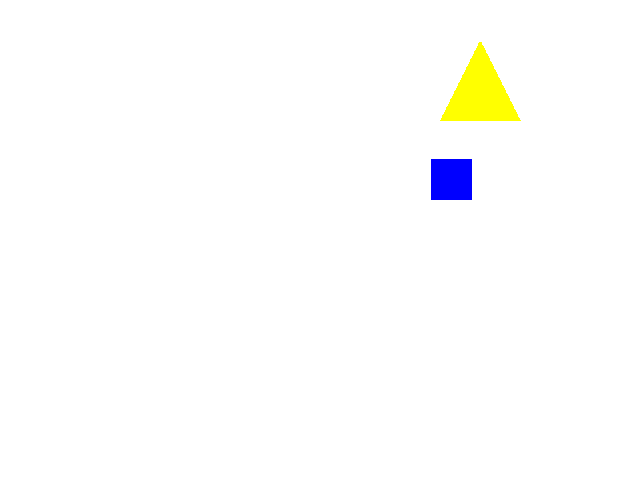

# YampaSDL2

YampaSDL2 is basically a headstart for the FRP library [Yampa](https://github.com/ivanperez-keera/Yampa) and SDL2. All the boilerplate which is normally necessary for these two libraries to work together is already taken care of. In the end, all that remains is a high-level interface specifically tailored to Yampa which should get you going in no time.



Screenshot of some drawn shapes.

**My primary Goals:**
- As little setup as possible
- Easy to use (some feedback would be appreciated)

## Roadmap

- [ ] Display Shapes
  - [x] Rectangle
  - [x] Circle
  - [x] Triangle
  - [ ] Polygon
- [x] Display Images
- [x] Animations
- [x] Handle Input
- [ ] Play sound

**This library is still work in progress**


## Getting started

### Prerequisites

yampa-sdl2 uses the C-libraries
- _sdl2_
- _sdl2-gfx_

Consequently, you need to have these two libraries installed on your computer.

### Installation

yampa-sdl2 is now on hackage! Adding yampa-sdl2 to your dependencies and executing the following should do the trick.

```bash
stack update
stack solver --update-config
stack build
```

## How to use

Head over to the [wiki](https://github.com/Simre1/yampa-sdl2/wiki).

## License

This project is licensed under the MIT License - see the [LICENSE](LICENSE) file for details.
